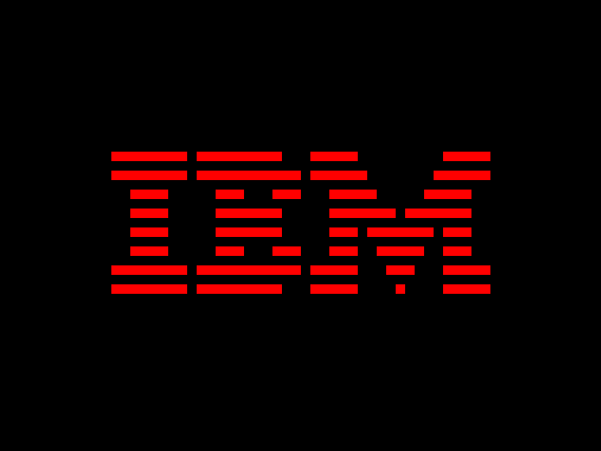

# Chip8 Emulator

This Chip8 emulator was created with the purpose of learning Go
and understanding emulation concepts. It's a simple emulator
for the Chip8 system.



## Current Status

At this moment, only the instructions to run the IBM logo are implemented and
working. However, the implementation of all the necessary Chip8 instructions
is in progress and will be completed soon.

## Features

Loads and runs the IBM logo sprite.
Basic structure for a Chip8 emulator using Go.

## Prerequisites

Go (Golang) installed on your machine. You can download it from golang.org.

### How to Run

Clone the repository:

```sh
git clone https://github.com/gbcosta/chip8-emulator.git
cd chip8-emulator
Build the project:
```

```sh
go build
Run the emulator:
```` 

```sh
./chip8-emulator
```

## License
This project is licensed under the MIT License.
